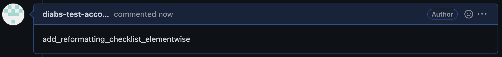
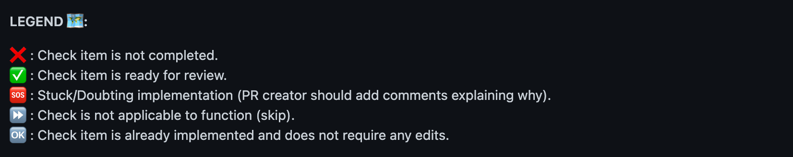

Open Tasks
==========

.. _`open tasks discussion`: https://github.com/unifyai/ivy/discussions/1403
.. _`repo`: https://github.com/unifyai/ivy
.. _`discord`: https://discord.gg/ZVQdvbzNQJ
.. _`open tasks channel`: https://discord.com/channels/799879767196958751/985156466963021854
.. _`Ivy Frontends`: https://lets-unify.ai/ivy/deep_dive/16_ivy_frontends.html
.. _`Ivy Frontend Tests`: https://lets-unify.ai/ivy/deep_dive/17_ivy_frontends_tests.html

Here, we explain all tasks which are currently open for
contributions from the community!

This section of the docs will be updated frequently, whereby new tasks will be added and
completed tasks will be removed. The tasks outlined here are generally broad high-level
tasks, each of which is made up of many individual sub-tasks,
distributed across task-specific
`ToDo list issues <https://github.com/unifyai/ivy/issues?q=is%3Aopen+is%3Aissue+label%3AToDo>`_.

The tasks currently open are:

#. Function Formatting
#. Frontend APIs

We try to explain these tasks as clearly as possible, but in cases where things are not
clear, then please feel free to engage with the `open tasks discussion`_,
or reach out on `discord`_ in the `open tasks channel`_!

Please always use the latest commit on GitHub when working on any of these tasks,
**DO NOT** develop your code using the latest PyPI release of :code:`ivy-core`.

Function Formatting
-------------------

Currently, we have many ToDo list issues
`open <https://github.com/unifyai/ivy/issues?q=is%3Aopen+is%3Aissue+label%3A%22Function+Reformatting%22+label%3AToDo>`_
for a general function formatting task,
which is explained below.

Each function in each submodule should be updated to follow the implementation
instructions given in the :ref:`Deep Dive` section.
The updates should be applied for the:

#. ivy API
#. all backend APIs
#. container static methods
#. array instance methods
#. container instance methods
#. array operators
#. array reverse operators
#. container operators
#. container reverse operators

The :ref:`Deep Dive` is an **essential** resource for learning how each of these
functions/methods should be implemented. Before starting any contribution task,
you should go through the :ref:`Deep Dive`, and familiarize yourself with the content.

At the time of writing, many of the functions are not implemented as they should be.
You will need to make changes to the current implementations,
but you do not need to address *all* sections of the :ref:`Deep Dive` in detail.
Specifically, you **do not** need to address the following:

#. implement the hypothesis testing for the function
#. get the tests passing for your function, if they are failing before you start

However, everything else covered in the :ref:`Deep Dive` must be addressed.
Some common important tasks are:

#. remove all :code:`lambda` and direct bindings for the backend functions
   (in :code:`ivy.functional.backends`), with each function instead defined using
   :code:`def`.
#. implement the following if they don't exist but should do: :code:`ivy.Array` instance
   method, :code:`ivy.Container` static method, :code:`ivy.Container` instance method,
   :code:`ivy.Array` special method, :code:`ivy.Array` reverse special method,
   :code:`ivy.Container` special method, :code:`ivy.Container` reverse special method.
#. Make sure that the aforementioned methods are added into the correct
   category-specific parent class, such as :code:`ivy.ArrayWithElementwise`,
   :code:`ivy.ContainerWithManipulation` etc.
#. correct all of the :ref:`Function Arguments` and the type hints for every
   function **and** its *relevant methods*, including those you did not implement
   yourself.
#. add the correct :ref:`Docstrings` to every function **and** its *relevant methods*,
   including those you did not implement yourself.
#. add thorough :ref:`Docstring Examples` for every function **and** its
   *relevant methods* and ensure they pass the docstring tests.

After creating your Pull Request on github, you should then produce the checklist
for the formatting task as follows: 

1. Add a comment with the following format: 
:code:`add_reformatting_checklist_<category_name>` on your PR, where *<category_name>* 
is the name of the category that the function belongs to. 

Using this formatting will then trigger our github automation bots to update your 
comment with the proper markdown text for the checklist. These updates might take a
few moments to take effect, so please be patient. 🙂

2. After adding the checklist to your PR, you should then modify this checklist with 
the status of each item according to the symbols(emojis) within the LEGEND section.

3. When all check items are marked as (✅, ⏩, or 🆗), you should request a review for 
your PR and we will start checking your implementation and marking the items as complete 
using the checkboxes next to them.

4. In case you are stuck or need help with one of the checklist items, please add the
🆘 symbol next to the item on the checklist, and proceed to add a comment elaborating
on your point of struggle with this item. The PR assignee will then see this comment
and address your issues.

**Notes**: 
1. It is important that the PR author is the one to add the checklist comment in
order to ensure they will have access to edit and update it later.
2. Please pay attention to the formatting of the checklist generating comment, as it is important.
3. Do not edit the checklist, if you are facing issues, please add them in a different comment.
4. Please refrain from using the checkboxes next to checklist items.

Frontend APIs
-------------

For this task, the goal will be to implement functions for each of the
frontend functional APIs (see :ref:`Ivy as a Transpiler`),
with frontend APIs implemented for:
:code:`JAX`, :code:`MXNet`, :code:`NumPy`, :code:`TensorFlow` and :code:`PyTorch`.

Currently, we have many ToDo list issues
`open <https://github.com/unifyai/ivy/issues?page=1&q=is%3Aopen+is%3Aissue+label%3AToDo+label%3A%22JAX+Frontend%22%2C%22TensorFlow+Frontend%22%2C%22PyTorch+Frontend%22%2C%22NumPy+Frontend%22>`_
for this task, which is explained below.

The general workflow for this task is:

#. implement the function by following the `Ivy Frontends`_ guide
#. write tests for your function by following the `Ivy Frontend Tests`_ guide
#. verify that the tests for your function are passing

There are a few points to take note of when working on your chosen frontend function:

#. you should only implement **one** frontend function.
#. the frontend function is framework-specific, thus it should be implemented in
   its respective frontend framework only.
#. each frontend function should be tested on all backends to ensure that conversions
   are working correctly.
#. type hints, docstrings and examples are not required for frontend functions.

In the case where your chosen function exists in all frameworks by default, but
is not implemented in Ivy's functional API, please convert your existing GitHub
issue to request for the function to be added to Ivy. Meanwhile, you can select
another frontend function to work on from the ToDo list! If you're stuck on a
function which requires complex compositions, you're allowed to reselect a function
too!

**Round Up**

This should have hopefully given you a good understanding of the basics for contributing.

If you're ever unsure of how best to proceed,
please feel free to engage with the `open tasks discussion`_,
or reach out on `discord`_ in the `open tasks channel`_!
